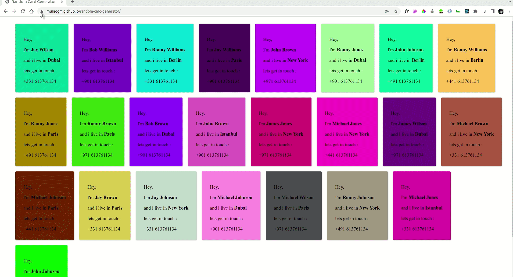

# Random Card Generator

A small React exercise to create a random card, with every refresh the card content and background color will change and will populate the card with new data.

## Demo

## Lessons Learned

#### in this project i learned:
1. how to setup the React app
2. how to add the package.json file and install all related dependencies 
3. how to connect different components 